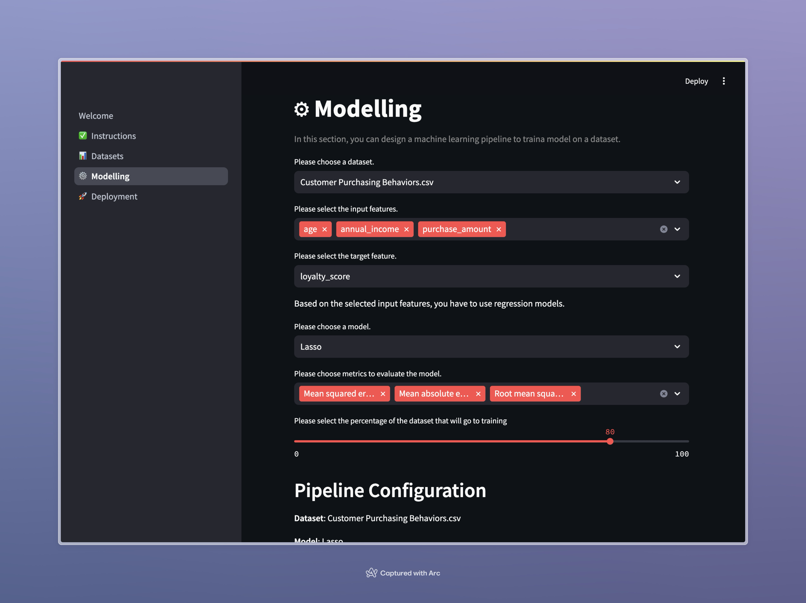
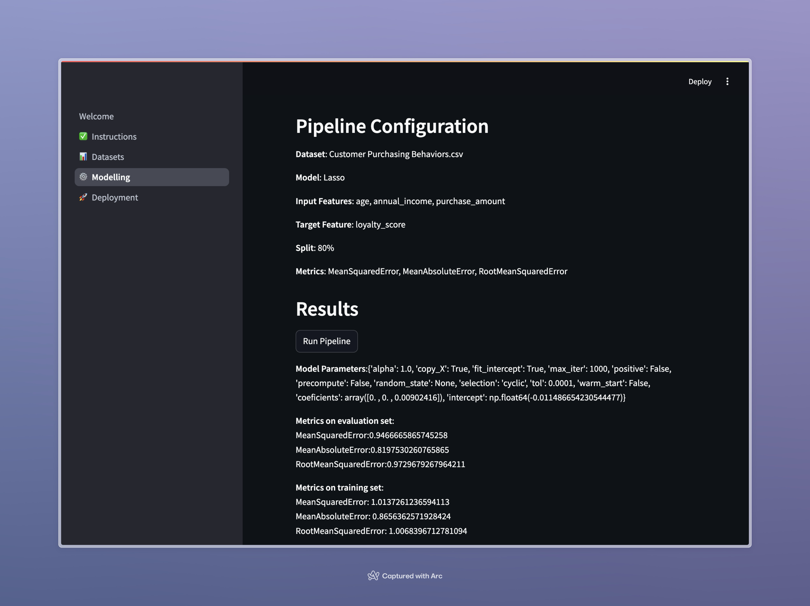
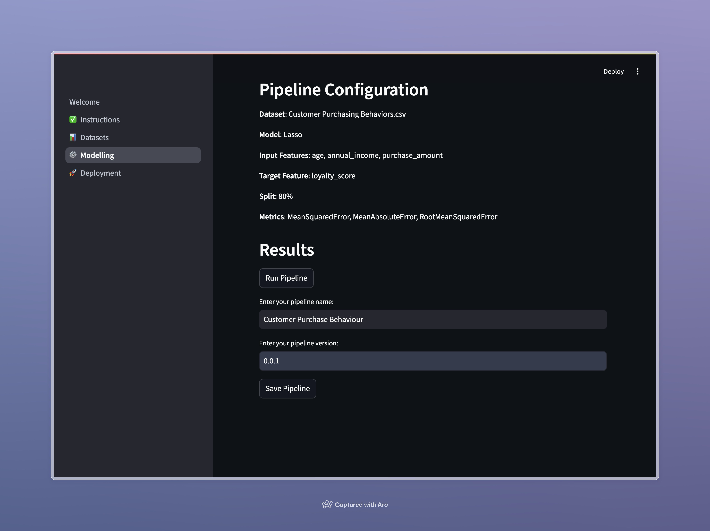
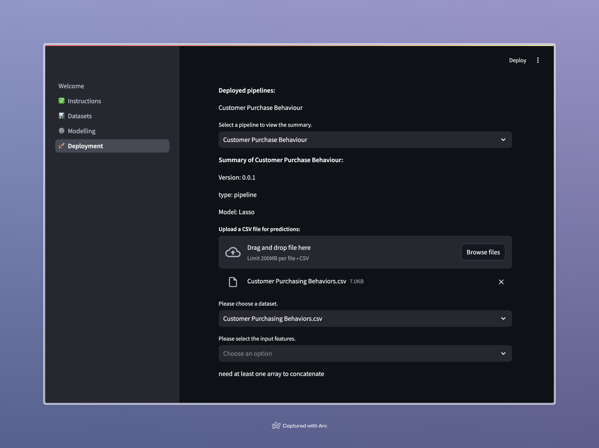
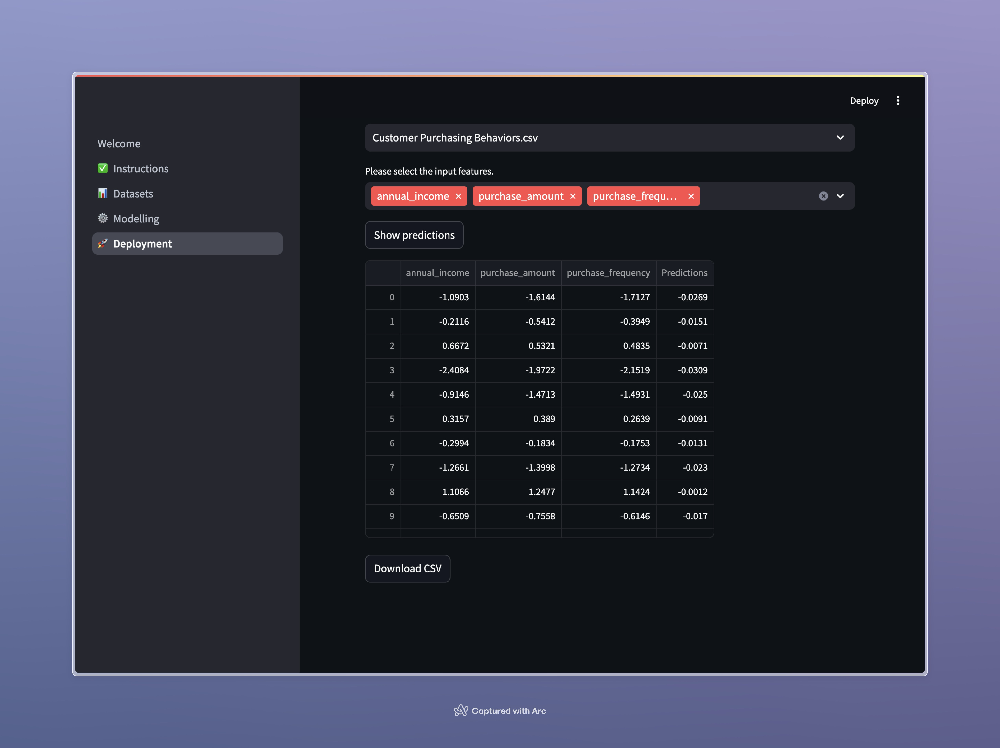

### Shocasing usage of our program on three datasets

1. Fish data
2. Customer Purchase Behaviour
3. Housing

Firstly, we create a pipeline for machine learing dataset. We can choos input features, target features, model, metrics and split.

Then the program will print out configuration of our pipeline. After that we can run the pipeline and get the results

With the button save, we will save the pipeline configuration in assets. There are also fields for name and version, which cannot stay empty. 

Then in the deploy section, we can see the saved pipeline configuration with a short summary. We can choose another file for prediction. After that we can choose the input features and click a button to get the predictions. 

We get predictions in table, which can then be saved in csv file using the Download CSV button.
